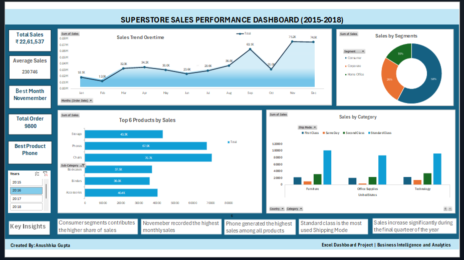

# Superstore Sales Dashboard

## Overview

An interactive sales dashboard developed in Microsoft Excel using the Superstore dataset to analyze sales performance across customer segments, categories, products, and time periods.

## Tools Used

* Microsoft Excel
* Pivot Tables
* Pivot Charts
* Slicers
* Data Cleaning
* Data Visualization

## Key Insights

* Consumer segment contributed the highest share of sales.
* November recorded the highest monthly sales.
* Phones emerged as the top-selling sub-category.
* Standard Class was the most frequently used shipping mode.
* Sales increased during the final quarter of the year.

## Files

* Dashboard Presentation (PPT)
* Dashboard Screenshot
* Dashboard PDF
* Excel Dashboard File

## Author

Anushka Gupta

Business Intelligence & Analytics Student
